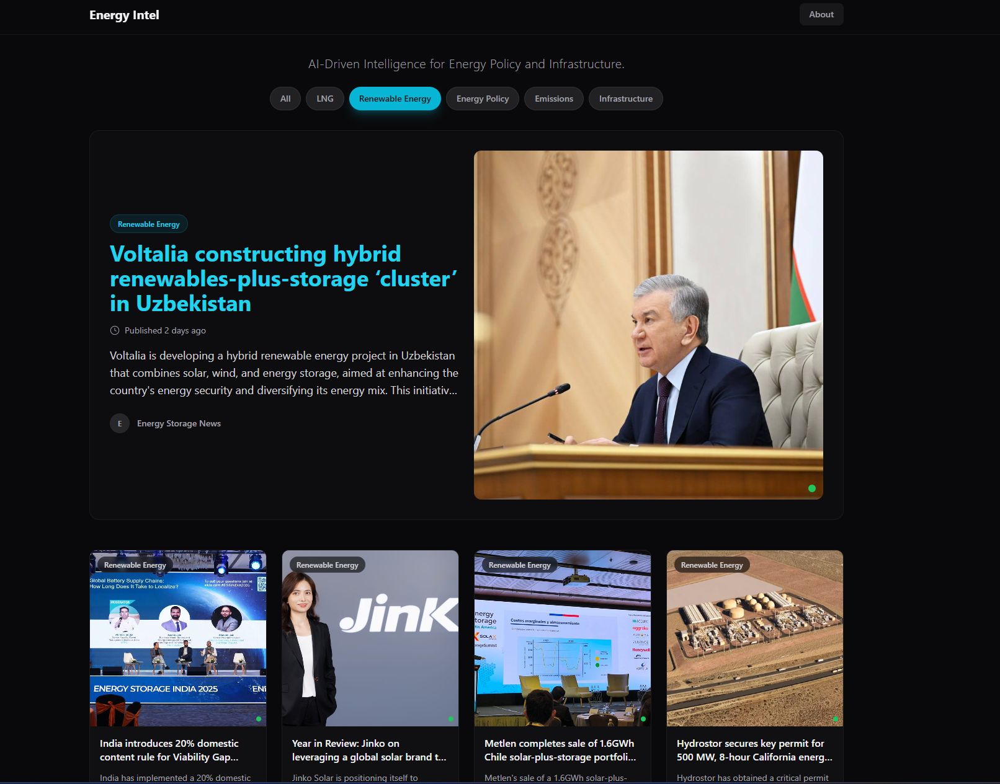

# Energy-Intel: U.S. Energy Policy Intelligence Platform




## Overview

**Energy-Intel** is an AI-powered energy intelligence platform designed to serve as a **centralized, continuously updated reference hub for U.S. energy policymakers, analysts, and policy-adjacent decision-makers**.

Please visit the website here https://energy-intel.org/

The platform aggregates, summarizes, and categorizes near real-time **U.S. energy policy, regulatory, and infrastructure-relevant developments**, reducing information fragmentation and enabling faster, evidence-based decision-making on issues critical to:

- U.S. energy security  
- Grid reliability and infrastructure planning  
- Energy affordability and market stability  
- Environmental and regulatory compliance  

Rather than reacting to user traffic, Energy-Intel operates as a **pre-processed intelligence system**, ensuring that decision-makers always access **policy-ready summaries**.

> **Version constraint (important):** This repository is designed for **Next.js 14.x**. Do **not** upgrade to Next.js 15+.

---

## Mission & Policy Alignment

**Mission:**  
To support U.S. energy policy formulation and infrastructure decision-making by providing a centralized, AI-driven intelligence platform that delivers timely, authoritative references to energy policies, regulatory actions, and sector-critical developments of national interest.

**Policy Gap Addressed:**  
Energy-related information is often fragmented across agencies, released faster than traditional analysis cycles, and difficult to synthesize at scale. Energy-Intel addresses this gap by automating ingestion and synthesis.

---

## Policy & Decision-Making Use Cases

Energy-Intel is designed to support real-world policy and infrastructure workflows, including:

- Monitoring federal and state energy regulatory developments
- Identifying emerging risks to grid reliability and energy affordability
- Tracking infrastructure investments related to AI, data centers, and electrification
- Supporting policy research, briefing preparation, and inter-agency coordination
- Providing timely references for compliance, planning, and oversight activities

The platform emphasizes speed, clarity, and reliability to reduce information lag in time-sensitive policy environments.

---

## Core Design Goals

1. **Timeliness** – Scheduled ingestion of official policy sources  
2. **Reliability** – Stable feeds independent of user traffic  
3. **Cost Control** – AI runs once per article, never at render time  
4. **Clarity** – Policy-focused summaries and clean architecture  

---

## High-Level Architecture

```
Official U.S. Energy Policy Sources
(FERC, EPA, DOE, EIA)
        ↓
Scheduled Ingestion (Cron)
        ↓
AI Summarization & Categorization
        ↓
Policy-Ready Database Storage
        ↓
Fast Read-Only API
        ↓
Frontend Feed (Instant Load)
```

---

## Technology Stack

### Frontend
- Next.js 14.x (App Router)
- TypeScript
- Tailwind CSS

### Backend
- Next.js Serverless API Routes
- Vercel Cron (scheduled ingestion)

### Data & Storage
- Supabase Postgres
- Indexed single-table design

### AI
- OpenAI API
- Model configurable via environment variables
- Summaries emphasize regulatory impact and national relevance

### Deployment
- Vercel (free-tier compatible)

---

## Data Sources

Energy-Intel ingests data exclusively from **authoritative U.S. government sources**:
- Federal Energy Regulatory Commission (FERC)
- Environmental Protection Agency (EPA)
- Department of Energy (DOE)
- Energy Information Administration (EIA)

Only metadata and short excerpts are stored. All entries link to original sources.

---

## Project Structure

```
energy-intel/
├── app/
│   ├── api/
│   │   ├── ingest/           # Scheduled ingestion (cron)
│   │   │   └── route.ts
│   │   └── articles/         # Read-only policy feed API
│   │       └── route.ts
│   ├── layout.tsx
│   └── page.tsx
│
├── components/
│   └── ArticleCard.tsx
│
├── lib/
│   ├── feeds.ts              # Official policy source definitions
│   ├── ingest.ts             # Shared ingestion pipeline
│   ├── summarize.ts          # AI policy summarization logic
│   ├── categorize.ts         # Topic & policy classification
│   └── db.ts                 # Supabase client
│
├── types/
│   └── article.ts
│
├── .env.local
├── vercel.json               # Cron configuration
├── package.json
└── README.md
```

---

## Key Engineering Decisions

### 1) No AI Calls During User Requests
AI processing occurs **ahead of time**, ensuring:
- Fast page loads
- Predictable AI costs
- No runtime AI dependency

### 2) Scheduled Ingestion
A cron-triggered pipeline fetches and processes policy updates on a fixed schedule.

### 3) Minimal, Transparent Data Model
A single `articles` table supports deduplication, historical tracking, and fast filtering.

### 4) Separation of Concerns
- Ingestion ≠ Serving
- AI logic ≠ UI logic
- Storage ≠ Presentation

---

## Version Pinning (Next.js 14.x)

```json
{
  "dependencies": {
    "next": "14.2.0",
    "react": "^18",
    "react-dom": "^18"
  }
}
```

---

## Environment Variables

Create `.env.local`:

```env
OPENAI_API_KEY=your_openai_api_key
OPENAI_MODEL=gpt-4o-mini

SUPABASE_URL=your_supabase_url
SUPABASE_ANON_KEY=your_supabase_anon_key
```

---

## Local Development

```bash
npm install
npm run dev
```

Open http://localhost:3000

---

## Deployment (Vercel)

1. Push repo to GitHub  
2. Import into Vercel  
3. Set environment variables  
4. Configure cron in `vercel.json`

```json
{
  "crons": [
    {
      "path": "/api/ingest",
      "schedule": "0 */6 * * *"
    }
  ]
}
```

---

## Performance Characteristics

- Instant page loads (DB reads only)
- Low API latency
- Flat AI cost profile
- Scales cleanly with users

---

## Purpose & Evaluation Context

Energy-Intel is a **live, verifiable system** demonstrating applied expertise in:
- Energy policy intelligence systems
- AI-assisted regulatory monitoring
- Cost-aware, production-grade AI pipelines

Designed for professional, academic, and policy-focused evaluation.

## Contributors

**Robin Godinho**  
Founder & Developer

Contact: rgodinho736@gmail.com

Energy-Intel was conceived, designed, and implemented by Robin Godinho.  
The contributor is responsible for:

- System architecture and technical design  
- Data ingestion and processing pipelines  
- AI summarization and classification logic  
- Cloud deployment and cost optimization  
- Policy alignment and information curation strategy  

This project is independently developed and maintained, with a focus on public-interest energy intelligence and policy support.

